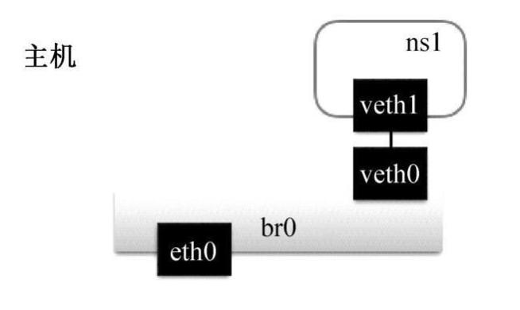

# 自己动手写docker

#  2.基础知识

## 2.1 linux namespace

- Namespace的API主要使用以下三个系统调用：
  - clone()：创建新进程，根据系统调用参数来判断哪些类型的Namespace被创建，而且它们的子进程也会被包含到这些Namespace中
  - setns()：将进程加入到Namespace中
  - unshare()：将进程移出某个Namespace

- Linux共实现了六种namespace。

### 1.1.1 Mount Namespace

- 系统调用参数 CLONE_NEWNS
- 隔离各个进程看到的挂载点视图，在不同的Mount Namespace中看到的文件系统层次不一样，在Mount Namespace中调用mount(),unmount()仅仅会影响当前Namespace内的文件系统，而对全局文件系统没影响
- 该namespace是Linux实现的第一个namespace类型

### 1.1.2 UTS Namespace

- 系统调用参数 CLONE_NEWUTS
- 隔离nodename和domainname两个系统标识，在每个UTS Namespace中可以设置自己的hostname

### 1.1.3 IPC Namespace

- 系统调用参数 CLONE_NEWIPC
- 隔离System V IPC和POSIX message queues，每个IPC Namespace中都有自己的System V IPC和POSIX message queue

### 1.1.4 PID Namespace

- 系统调用参数 CLONE_NEWPID
- 隔离进程PID，同一个进程在不同的PID Namespace里拥有不同的PID

### 1.1.5 Network Namespace

- 系统调用参数 CLONE_NEWNET
- 用来隔离网络设备，IP地址端口等网络栈

### 1.1.6 Uer Namespace

- 系统调用参数 CLONE_NEWUSER
- 隔离用户的用户组ID


## 2.2 Linux Cgroups

### 2.2.1 什么是Linux Cgroups

- Linux Cgroups提供了对一组进程及将来子进程的资源限制，控制和统计的能力，这些资源包括CPU,内存，存储，网络等
- Cgroups中的三个组件
  - cgroup 是对进程分组管理的一种机制，一个cgroup包含一组进程，并可以在这个cgroup上增加Linux subsystem的各种参数配置，将一组进程和一组subsystem的系统参数关联起来
  - subsystem是一组资源控制的模块，一般包含如下几项：
    - blkio 设置对块设备输入输出的访问控制
    - cpu设置cgroup中进程的CPU被调度的策略
    - cpuacct可以统计cgroup中进程的CPU占用
    - cpuset在多核机器上设置cgroup中进程可以使用的CPU
    - devices控制cgroup中进程对设备的访问
    - ······
  - hierarchy的功能是把一组cgroup串成一个树状的结构，一个这样的树便是一个hierarchy，通过这种树状结构，Cgroups可以做到继承。
  - 三个组件的关系（略）

- kernel接口

  - 创建并挂载一个hierarchy

    ```shell
    mkdir cgroup-test
    # 挂载
    mount -t cgroup -o none,name=cgroup-test cgroup-test ./cgroup-test
    # 查看
    ls ./cgroup-test # 该目录下的文件就是hierarchy中cgroup根节点的配置项
    # cgroup.clone_children  cgroup.procs  cgroup.sane_behavior  notify_on_release  release_agent  tasks
    ```

    cgroup.clone_children: cpuset的subsystem会读取这个配置文件，如果这个值为1（默认为0），子cgroup才会继承父cgroup的cpuset的配置

    Cgroup.porc是树中当前节点cgroup中的进程组，现在的位置是在根节点，这个文件中会有现在系统中所有的进程组的ID
  
    Notify_on_release和release_agent会一起使用.notify_on_release标识当这个cgroup最后一个进程退出的时候是否执行了release_agent；
  
    Release_agent则是一个路径，通常用作进程退出之后自动清理不再使用的cgroup
  
    tasks标识该cgroup下面的进程ID，如果一个进程的ID写到tasks文件中，便是将相应的进程加入到这个cgroup中
  
    
  
  - 在创建好的hierarchy上cgroup根节点上扩展出两个cgroup
  
    ```shell
    mkdir cgroup-1
    mkdir cgroup-2
    
    tree
    
    # 结果显示如下
    .
    ├── cgroup-1
    │   ├── cgroup.clone_children
    │   ├── cgroup.procs
    │   ├── notify_on_release
    │   └── tasks
    ├── cgroup-2
  │   ├── cgroup.clone_children
    │   ├── cgroup.procs
  │   ├── notify_on_release
    │   └── tasks
  ├── cgroup.clone_children
    ├── cgroup.procs
    ├── cgroup.sane_behavior
    ├── notify_on_release
    ├── release_agent
  └── tasks
    
    ```
  ```
  
    
  
  - 在cgroup中添加和移动进程
  
    将进程号写入到相应cgroup的tasks文件中即可，一个进程在一个Cgroups的hierarchy中，只能在一个cgroup节点上存在
  
    ```shell
    sh -c "echo $$ >> tasks"
  ```
  
  - 通过subsystem限制cgroup中进程的资源
  
    上面创建的hierarchy没有关联到任何的subsystem,所以没办法通过这个hierarchy中的cgroup节点限制进程的资源占用，其实系统默认为每个subsystem创建了一个默认的hierarchy，比如memory的hierarchy
  
    ```shell
    mount | grep memory
    # cgroup on /sys/fs/cgroup/memory type cgroup
    ```
  
    可以看到，/sys/fs/cgroup/memory目录便是挂在了memory subsystem的hierarchy上，下面，就通过在这个hierarchy中创建cgroup，限制进程占用的内存
  
    ```shell
    # 首先，在不做限制的情况下，启动一个占用内存的stress进程
    [memory]$  stress --vm-bytes 200m --vm-keep -m 1
    # 创建一个cgroup
    sudo mkdir test-limit-memory && cd test-limit-memory
    # 设置最大cgroup的最大内存占用为100mb
    sudo sh -c "echo "100m" > memory.limit_in_bytes"
    # 将当前进程移动到这个cgroup中
    sudo sh -c "echo $$ > tasks"
    # 再次运行占用内存200mb的stress进程
    stress --vm-bytes 200m --vm-keep -m 1
    
    ```
  
    

### 2.2.2 Docker是如何使用Cgroups的


### 2.2.3用Go语言实现cgroup限制容器的资源

## 2.3 Union File System

### 2.3.1 什么是Union File System

UnionFS是一种为Linux操作系统设计的，把其他文件系统联合到一个联合挂载点的文件系统服务

写时复制：如果一个资源是重复的，但没有任何修改，这时并不需要创建一个新的资源，这个资源可以被新旧实例共享。创建新资源发生在第一次写操作，也就是对资源进行修改的时候。

### 2.3.2 AUFS Advanced Multi-Layered Unification Filesystem


### 2.3.3 Docker是如何使用AUFS的

#### image layer和AUFS

每个Docker image都是由一系列read-only layer组成的，image layer的内容都存储在Docker hosts filesystem的/var/lib/docker/aufs/diff目录下，而/var/lib/docker/aufs/layers目录，则存储着image layer如何堆栈这些layer的metadata

```shell
docker pull ubuntu
# 会在diff目录下产生四个layer
# 写dockerfile，在ubuntu镜像的/tmp/newfile写入hello world
docker build -t changed-ubuntu .
docker images
docker history changed-ubuntu
# 可以看到changed-ubuntu镜像只占用了很少的磁盘空间，这证明了AUFS是如何高效使用磁盘空间的
```

#### container layer和AUFS

启动一个container的时候，Docker会为其创建一个read-only的init layer,用来存储与这个容器内环境相关的内容，Docker还会为其创建一个read-write的layer来执行所有写操作

container layer的mount目录也是/var/lib/docker/aufs/mnt。container的metadata和配置文件都存放在/var/lib/docker/containers/< container-id >目录中。container的read-write layer存储在/var/lib/docker/aufs/diff/目录下。

即使容器停止，这个可读写层仍然存在，因而重启容器不会丢失数据，只有当一个容器被删除的时候，这个可读写层才会一起删除。

删除文件时，如果要删除file1，AUFS会在container的read-write层生成一个.wh.file1的文件来隐藏所有的read-only层的file1文件


### 2.3.4 自己动手写AUFS


```shell
# 创建aufs目录，在该目录下新建六个文件夹，container-layer,里面创建一个文件，container-layer.txt，内容为I am container layer，其他四个文件夹为image-layer{n},里面文件为image-layer{n}.txt，文件内容为I am image-layer{n} ，另一个文件夹为mnt
cd aufs
ls
# container-layer image-layer1 image-layer2 image-layer3 image-layer4 mnt

# 将container-layer和4个image-layer文件夹用AUFS的方式挂载到刚刚创建的mnt目录中下。
# mount aufs的命令中，没有置顶待挂载的5个文件夹的权限，默认的行为是，dirs指定的左边起第一个目录是read-write权限，后续的都是read-only权限

sudo mount -t aufs -o dirs=./container-layer:./image-layer4:./image-layer3:./image-layer2:./image-layer1 none ./mnt

tree mnt
# mnt
# |-- container-layer.txt
# |-- image-layer1.txt
# |-- image-layer2.txt
# |-- image-layer3.txt
# |-- image-layer4.txt

## 在mnt目录下修改image-layer4.txt的内容
## 之后查看image-layer4目录下的image-layer4.txt的内容是否改变：没改变；而查看container-layer目录下，则多个了image-layer4.txt的文件。此时证明了AUFS的写时复制以及容器原理
```

## 2.4 小结


# 3.构造容器

## 3.1 构造实现run命令版本的容器

- 实现docker run -ti /bin/sh

- 个人理解-大致流程：父进程mydocker会新创建一个进程，该进程会设置namespace，然后/proc/self/exe init args运行自己的init命令，用于设置相应环境，比如挂载proc文件系统，设置完环境后通过调用系统exec将用户指定的程序替换掉init命令即可

  

### 3.1.1 Linux proc文件系统介绍

Linux下的/proc文件系统是由内核提供的，它其实不是一个真正的文件系统，只包含了系统运行时的信息（比如系统内存，mount设备信息，一些硬件配置等），它只存在于内存中，而不占用外存空间。它以文件系统的形式，为访问内核数据的操作提供接口。很多系统工具都是简单的去读取这个文件系统的某个文件内容


当遍历这个目录的时候，会发现很多数字，这些都是为每个进程创建的空间，数字就是他们的PID

```shell
/proc/N # PID为N的进程信息
/proc/N/cmdline # 进程启动命令
/proc/N/cwd # 链接到进程当前工作目录
/proc/N/environ # 进程环境变量列表
/proc/N/exe # 链接到进程的执行命令文件
/proc/N/fd # 包含进程相关的所有文件描述符
/proc/N/maps # 与进程相关的内存映射信息
/proc/N/mem # 指代进程持有的内存，不可读
/proc/N/root # 链接到进程的根目录
/proc/N/stat # 进程的状态
/proc/N/statm # 进程使用的内存状态
/proc/N/status # 进程状态信息，比stat/statm更具可读性
/proc/self/ # 链接到当前正在运行的进程
```

### 3.1.2 实现run命令

执行 ./mydocker run -ti /bin/sh 

1）runCommand. 解析出用户指定的应用程序/bin/sh以及-ti这个run的flag

2）将/bin/sh和ti作为参数调用run方法，run方法中会调用NewParentProcess，之后调用wait方法结束

3）在NewParentProcess方法中，创建了新的具有自己的namespace的进程，在新的进程中调用了自己的init命令（proc/self/exe init /bin/sh）init是内部方法， 不允许外部调用

4）init命令进行了一些初始化操作，比如挂载proc文件系统等，然后通过系统调用exec，运行用户指定的程序/bin/sh，至此，容器的1号进程转变为/bin/sh


## 3.2 增加容器资源限制

- 实现docker run -ti -m 100m /bin/sh
- 个人理解-大致流程：通过将新建的cgroup放入相应的subsystem中，比如memory的限制，就会在memory对应的根cgroup下创建一个子cgroup（根cgroup可以通过/proc/self/mountinfo中查找memory对应的挂载目录：/sys/fs/cgroup/memory，即在该目录下创建一个子cgroup），然后对子cgroup下的内存资源进行相应的设置，然后将容器进程号添加到相应的tasks中即可（容器的资源限制要在其父进程mydocker中进行限制）


实现./mydocker run -ti -m 100m -cpuset 1 -cpushare 512 /bin/sh

### 3.2.1定义Cgroups的数据结构

- 回顾：Cgroups包含hierarchy，cgroup，subsystem三个概念。cgroup hierarchy中的节点，用于管理进程和subsystem的控制关系 ，subsystem作用于hierarchy上的cgroup节点，并控制节点中进程的资源占用，hierarchy将cgroup通过树状结构串起来，并通过虚拟文件系统的方式暴露给用户

- 数据结构

  ```go
  //传递资源限制配置的结构体
  type ResourceConfig struct{
    MemoryLimit string  //内存限制
    CpuShare    string  //cpu时间片权重
    CpuSet      string  //cpu核心数
  }
  
  //subsystme接口，每个subsystem可以实现下面的4个接口
  //这里将cgroup抽象成了path，原因是cgroup在hierarchy的路径，便是虚拟文件系统中的虚拟路径
  type Subsystem interface {
  	//返回subsystem的名字，比如cpu memory
    Name() string
    //设置某个cgroup在这个Subsystem中的资源限制
    Set(path string, res *ResourceConfig) error
    //将进程添加到某个cgroup中
    Apply(path string,pid int) error
    //移除某个cgroup
    Remove(path string) error
  }
  
  //通过不同的subsystem初始化实例创建资源限制处理链数组
  var {
    SubsystemsIns = []Subsystem{
      &CpusetSubSystem(),
      &MemorySubSystem(),
      &CpuSubSystem(),
    }
  }
  ```

  以memory的subsystem为例：

  ```go
  // 略 （看书去）
  type MemorySubSystem struct{
  }
  
  ```

  寻找cgroup的绝对路径时，需要先通过/proc/self/mountinfo来找到对应subsystem挂载的hierarchy相对路径对应的cgroup在虚拟文件系统中的路径，然后通过这个路径在去操作cgroup

  

  最后需要把不同的subsystem中的cgroup管理起来，并与容器建立关系

  ```go
  type CgroupManager struct{
    //cgroup在hierarchy中的路径，相当于创建的cgroup目录相对于各root cgroup目录下的路径
    Path string
    //资源配置
    Resource *subsystems.ResourceConfig
  }
  
  func NewCgroupManager(path string) *CgroupManager{
    return &CgroupManager{
      Path:path,
    }
  }
  
  //将进程PId加入到每个cgroup中
  func (c *CgroupManager) Apply(pid int) error{
    for _,subSysIns := range(subsystems.SubsystemsIns){
      subSysIns.Apply(c.Path,pid)
    }
    return nil
  }
  
  //设置各个subsystem挂载中的cgroup资源限制
  func (c *CgroupManager) Set(res *subsystems.ResourceConfig) error{
    for _,subSysIns := range(subsystems.SubsystemsIns){
      subSysIns.Set(c.Path,res)
    }
    return nil
  }
  
  //释放各个subsystem挂载中的cgroup
  func (c *CgroupManager) Destroy() error{
    for _,subSysIns := range(subsystems.SubsystemsIns){
      if( err := subSysIns.Remove(c.Path);err != nil){
        logrus.Warf("remove cgroup fail %v",err)
      }
    }
    return nil
  }
  ```

  

  

  

### 3.2.2 在启动容器时增加资源限制的配置

```go
func Run(tty bool,cmd string, res *subsystems.ResourceConfig){
  parent := container.NewParentPorcess(tty,cmd) //创建容器进程
  if parent == nil{
    log.Errorf("New parent process error")
    return
  }
  if err := parent.Start();err!=nil{
    log.Error(err)
  }
  ...
  
  //在mydocker进程里对容器进程做资源限制
  //使用mydocker-cgroup作为cgroup的名字
	cgroupManager := 		cgroups.NewCgroupManager("mydocker-cgroup")
	defer cgroupManager.Destroy() //函数退出时释放掉创建的cgroup

	cgroupManager.Set(res) //设置资源限制
	cgroupManager.Apply(parent.Process.Pid) //将容器进程加入到各个subsystem挂载对应的cgroup中

  parent.Wait()  //mydocker作为容器的父进程，要等待回收子进程结束后的资源
   os.Exit(0)
}
```


## 3.3 增加管道及环境变量识别

- 个人理解-大致流程：在创建子进程时，创建匿名管道，让父进程mydocker拥有写端，子进程拥有读端，在父进程mydocker中将命令参数通过管道传入给子进程，子进程在执行init命令时，通过读端读到参数，然后通过系统调用exec将读到的命令及相应参数传入，从而运行用户指定的程序


在之前的版本里，run命令又一个缺陷：在父进程(mydocker)和子进程（容器进程)之间传参数，是通过调用命令后面跟上参数，也就是/proc/self/exe init args这种方式进行的，然后在init进程中解析这个参数，执行相应的命令。 缺点是：如果用户输入的参数很长，或者其中带有一些特殊字符，这种方案就会失败。其实，runC实现的方案是通过匿名管道来实现父子进程之间通信的。

- 匿名管道：IPC的一种方式，用于具有亲缘关系的进程之间；
- 有名管道，又称FIFO管道，存在于文件系统的管道，可以被两个没有任何亲缘关系的进程进行访问，一般可以通过mkfifo()函数来创建
- 管道是半双工，一端用于写操作，一端用于读操作。从本质上来说，管道也是文件中的一种，和文件通信的区别在于，管道有一个固定大小的缓冲区，大小一般是4KB，当管道被写满时，写进程就会阻塞，直到有读进程把管道里的内容读出来。同样的当读进程从管道拿数据时，如果没数据也会阻塞，直到写进程写入数据

代码实现：

```go
//父进程 mydocker 
func Run(tty bool,cmdArray []string){
  parent,writePipe := container.NewParentPorcess(tty) //创建容器进程
  if parent == nil{
    log.Errorf("New parent process error")
    return
  }
  if err := parent.Start();err!=nil{
    log.Error(err)
  }
  ...
  
  //在mydocker进程里对容器进程做资源限制
  ...

  //发送用户命令
  sendInitCommand(cmdArray,writePipe)
  
  parent.Wait()  //mydocker作为容器的父进程，要等待回收子进程结束后的资源
  os.Exit(0)
}
```


```go
//子进程的设置
func NewParentProcess(tty bool)(*exec.Cmd,*os.File){
  readPipe,writePipe,err := NewPipe() //创建管道
  cmd := exec.Command("/proc/self/exe","init") //子进程：执行init命令(自己调用自己的)
  cmd.SysProcAttr = &syscall.SysProcAtttr{
    Cloneflags: syscall.CLONE_NEWUTS | syscall.CLONE_NEWPID | syscall.CLONE_NEWNS | syscall.CLONE_NEWNET | syscall.CLONE_NEWIPC,
  }
  if tty{
    cmd.Stdin = os.Stdin
    cmd.Stdout = os.Stdout
    cmd.Stderr = os.Stderr
  }
  
  //给子进程传入管道文件读取端的句柄,通过额外文件传入，进程一创建就会默认有三个文件stdin stdout stderr,因此现在这个管道读取端是子进程第四个文件描述符
  cmd.ExtraFiles = []*os.File(readPipe)
  //给父进程mydocker返回管道文件的写入端的句柄
  return cmd,writePipe
}


//在init命令对应的函数里
func RunContainerInitProcess() error{
  cmdArray := readUserCommand()
  if(cmdArray == nil || len(cmdArray) == 0){
    return fmt.Errorf("Run container get user command error, cmdArray is nil")
    //设置mount选项
    defaultMountFlags := syscall.MS_NOEXEC | syscall.MS_NOSUID | syscall.MS_NODEV
    //挂载proc文件系统
  	syscall.Mount("proc","/proc","proc",uintptr(defaultMountFlags),"")
    
    //调用exec.LookPath,可以在系统的PATH里面寻找命令的绝对路径，因此原先需要写/bin/sh ，现在只需要写sh即可
    path,err := exec.LookPath(cmdArray[0])
    if err!=nil {
      log.Errorf("Exec loop path error %v",err)
      return err
    }
    //系统调用调用exec将init命令替换成用户指定的程序，传入的参数为(用户指定的程序，参数，环境变量)
    if err := syscall.Exec(path,cmdArray[0:],os.Environ());err!=nil{
      log.Errorf(err.Error())
    }
    return nil
  }
}
```


## 3.4 总结


# 4.构造镜像

## 4.1 使用busybox构造容器

- 个人理解-大致流程：使用pivot_root修改根目录（不太明白这里）


第三章使用namespace和Cgroups技术创建了一个简单的容器，但可以发现，目前容器内的目录还是当前运行程序的目录，运行一下mount命令会发现，可以看到继承来自父进程的所有挂载点，这是因为缺少了镜像这么一个重要的特性。

这一节我们就来做一个简单的镜像，让容器跑在有镜像的环境中

### 4.1.1 busybox

```shell
docker pull busybox
docker run -d busybox top -b

docker export -o busybox.tar container-id
tar -xvf busybox.tar -C busybox/

ls busybox
# bin dev etc home proc root sys tmp usr var
```

### 4.1.2 pivot_root (有疑问)

Pivot_root是一个系统调用，主要功能是改变当前的root文件系统

pivot_root和chroot的主要区别是，pivot_root是把整个系统切换成一个新的root目录，而移除对之前root文件系统的依赖，这样你就能够umount原先的root文件系统。而chroot是针对某个进程，系统的其他部分依旧运行于老的root目录中


## 4.2 使用AFUS包装busybox

- 实现只读层和读写层
- 个人理解-大致流程：创建容器文件系统挂载点mnt目录和容器的读写层目录writeLayer，创建容器时，将镜像文件作为可读层(比如 busybox的镜像文件，使用docker export可以生成，解压到只读层目录即可)，writeLayer作为读写层，使用aufs，挂载到mnt目录，然后设置容器当前目录为mnt目录即可，容器退出时，首先卸载容器文件系统的挂载点，然后删除挂载点，然后删除读写层


上一节已经实现了使用宿主机/root/busybox目录作为文件的根目录，但在容器内对文件的操作仍然会直接影响到宿主机的/root/busybox目录，本节要进一步进行容器和镜像的隔离，实现在容器中运行的操作不会对镜像产生任何影响

```go
func NewWorkSpace(rootURL string,mntURL string){
  CreateReadOnlyLayer(rootURL)
  CreateWriteLayer(rootURL)
  CreateMountPoint(rootURL,mntURL)
}
//将busybox.tar解压到busybox目录下，作为容器的只读层
func CreateReadOnlyLayer(rootURL string){
  busyboxURL := rootURL + "busybox/"
  busyboxTarURL := rootURL + "busybox.tar"
  exist,err := PathExists(busyboxURL)
  ...
}

//创建一个writeLayer的文件夹作为容器唯一的可写层
func CreateWriteLayer(rootURL string){
  writeURL := rootURL + "writeLayer/"
  os.Mkdir(writeURL,0777)
}

//创建挂载点,使用aufs创建ufs
func CreateMountPoint(rootURL string,mntURL string){
  os.Mkdir(mntURL,0777)
  dirs := "dirs=" + rootURL + "writeLayer:" + rootURL + "busybox"
  cmd := exec.Command("mount","-t","aufs","-o",dirs,"none",mntURL)
  cmd.run()                   
}

```

```go
//mydocker创建子进程时对子进程进行设置 
func NewParentProcess(tty bool)(*exec.Cmd,*os.File){
  ...
  cmd.ExtraFiles = []*os.File(readPipe)
	
  //使用aufs构建ufs
  mntURL := "/root/mnt/"
  rootURL := "/root"
  NewWorkSpace(rootURL,mntURL)  //创建可写层和UFS挂载点
  cmd.Dir = mntURL
  
  return cmd,writePipe
}
```


Docker会在删除容器的时候，把容器对应的Write Layer和Contaienr-init Layer层删除，而保留镜像所有的内容。本节中，容器退出时会删除Write Layer/DeleteWorkSpace函数包括DeleteMountPoint和DeleteWriteLayer

​	

​	最后，在DeleteWriteLayer函数中删除WriteLayer文件夹

```go
//删除挂载点和可写层
func DeleteWorkSpace(rootURL string,mntURL string){
  DeleteMountPoint(rootURL,mntURL)
  DeleteWriteLayer(rootURL)
}

//首先，在DeleteMountPoint函数中umount mnt目录
//然后，删除mnt目录
func DeleteMountPoint(rootURL string, mntURL string){
  cmd := exec.Command("umount",mntURL)
  cmd.Run()
  os.RemoveAll(mntURL)
}

//删除可写层
func DeleteWriteLayer(rootURL string){
  writeURL := rootURL + "writeLayer/"
  os.RemoveAll(writeURL)
}

```


## 4.3 实现volume数据卷

- 实现 docker run -ti -v /root/volume:/containerVolume sh
- 个人理解-大致流程：在使用aufs设置容器文件系统时，检测volume，如果有需要将宿主机目录使用aufs挂载到容器目录中；在容器退出时，同样的，先卸载volume挂载的文件系统；之后再卸载容器整个文件系统的挂载点mnt，之后删除挂载点，最后将容器可写层目录删除。(注意对于volume只卸载挂载点，volume挂载点目录会在删除容器文件系统的挂载点时一并删除，但不会删除volume对应的宿主机目录，从而将部分数据保留)


一旦容器退出后，容器可写层的所有内容都会被删除，如何持久化容器里的部分数据呢？

实现过程如下：

```go
/*
启动容器的时候
 1.创建只读层（busybox)
 2.创建容器读写层(writeLayer)
 3.创建挂载点(mnt),并把只读层和读写层挂载到挂载点
 4.判断volume是否为空，如果是，表示用户没有使用挂载标签
 5.如果不为空，则使用volumeUrlExtract函数解析voume字符串
 6.当volumenUrlExtract函数返回的字符数组长度为2，并且数据元素不为空的时候，则执行MountVolume函数来挂载数据卷
 7.否则，提示用户创建数据卷输入不对
 8.将挂载点作为容器的根目录
*/
func MountVolume(rootURL string,mntURL string,volumeURLs []string){
	//创建宿主机文件目录
	parentUrl := volumeURLs[0]
	os.Mkdir(parentUrl,0777)
	
	//在容器文件系统里创建挂载点
  containerUrl := volumeURLs[1]
  containerVolumeURL := mntURL + containerUrl
  os.Mkdir(containerVolumeURL,0777)
  
  //把宿主机文件目录挂载到容器挂载点
  dirs := "dirs=" + parentUrl
  cmd := exec.Command("mount","-t","aufs","-o",dirs,"none",containerVolumeURL)
  cmd.Run()
}

/*
容器退出的时候
 1.卸载volume挂载点的文件系统（/root/mnt/${containerUrl}),保证整个容器的挂载点没有被使用
 2.卸载整个容器文件系统的挂载点(mnt)
 2.删除容器文件系统挂载点
 3.删除读写层(writeLayer)
*/

func DeleteMountPointWithVolume(rootURL string,mntURL string,volumeURLs []string){
  //卸载容器里volume挂载点的文件系统
  containerUrl := mntURL + volumeURLs[1]
  cmd := exec.Command("umount",containerUrl)
  cmd.Run()
  
  //卸载整个容器文件系统的挂载点
  exec.Command("umount",mntURL)
  exec.Run()
  
  //删除容器文件系统挂载点
  os.RemoveAll(mntURL)
}
```

## 4.4 实现简单镜像打包 

- 实现docker commit image，结果是将容器打包成image.tar
- 个人理解-大致流程：(个人理解这是export的功能，但书里写着是commit的功能)：将容器整个文件系统的挂载目录mnt打包成tar文件输出即可


```go
func commitContainer(imageName string){
  mntURL := "/root/mnt"
  imageTar := "/root/" + imageName + ".tar"
  exec.Command("tar","-czf",imageTar,"-C",mntURL,".").CombinedOutput();
}
```

## 4.5 小结


# 5.构建容器进阶


## 5.1 实现容器的后台运行

- 实现 docker run -d top

- 个人理解-大致流程：添加run命令的d选项，如果有d选项，则mydocker进程不会执行parent.wait()。这样做，mydocker进程将执行结束，使容器进程变成孤儿进程，由init(1号进程)收养

## 5.2 实现查看运行中的容器

- 实现docker ps

- 个人理解-大致流程：当mydocker进程创建出容器进程获得子进程号后，记录下容器进程的信息，比如PID，containerName，containerID，createTime等等，将信息保存到默认的宿主机目录里，比如保存到/var/run/mydocker/容器名/config.json；当调用ps命令时，到默认的宿主机目录/var/run/mydocker/里查找所有容器信息即可

  

### 5.2.1 准备数据


关于容器的信息，比如PID，容器创建时间，容器运行命令等，都没有记录，因此首先需要保存下这些数据

```go
// 首先在run命令中添加name选项，表示容器名字

// 生成容器id，可以随机生成10位数字

//定义容器的一些基本信息，比如PID和创建时间等，默认以json形式存储在宿主机的/var/run/mydocker/容器名/config.json文件里面
type ContainerInfo struct{
  Pid         string    `json:"pid"`       //容器的init进程在宿主机上的PID
  Id          string    `json:"id"`        //容器id
  Name        string    `json:"name"`      //容器名字
  Command     string    `json:"command"`   //容器内init进程的运行命令
  CreatedTime string    `json:"createTime"`
//创建时间
  Status      string    `json:"status"`
//容器的状态
}

//定义常量
var {
  RUNNING     string = "running"
  STOP        string = "stopped"
  EXIT        string = "exited"
  DefaultInfoLocation  string = "/var/run/mydocker/%s/"
  ConfigName  string = "config.json"
}


func recordContainerInfo(containerPID int,commandArray []string, containerName string)(string,error){
  id := randstringBytes(10) //生成容器id
  createTime := time.Now().Format("2006-01-02 15:04:05")
  command := strings.Join(commandArray,"")
  //如果用户不指定容器名，那么容器id为容器名
  if containerName == ""{
    containerName = id
  }
  //生成容器信息的结构体实例
  containerInfo := &container.ContainerInfo{
    Id: id,
    Pid: strconv.Itoa(containerPID),
    Command: command,
    CreateTime: createTime,
    Status: container.RUNNING,
    Name: containerName,
  }
  //将容器信息的对象json序列化字符串
  jsonBytes,err := json.Marshal(containerIfo)
  jsonStr := string(jsonBytes)
  
  //拼凑一下存储信息的路径
  dirUrl := fmt.Sprintf(container.DefaultInfoLocation,containerName)
  //如果该路径不存在，就级联创建
  os.MkdirAll(dirUrl,0622)
  fileName := dirUrl + "/" + container.ConfigName
  
  //创建最终的配置文件 config.json文件
  file,err := os.Create(fileName)
  defer file.Close()
  
  file.WriteString(jsonStr)
  
  return containerName,nil
}
```


```go
//在mydocker的run命令对应的函数里，当新建子进程获得init子进程的进程号后，调用recordContainerInfo函数即可
func Run(tty bool,cmdArray []string){
  parent,writePipe := container.NewParentPorcess(tty) //创建容器进程
  parent.Start();
  
  //记录容器信息
  containerName,err := recordContainerInfo(parent.Process.Pid,cmdArray,containerName)
  ...
  
  //在mydocker进程里对容器进程做资源限制
  ...

  //发送用户命令
  sendInitCommand(cmdArray,writePipe)
  
  if tty {
    parent.Wait()  //mydocker作为容器的父进程，要等待回收子进程结束后的资源
    deleteContainerInfo(containerName) //当容器进程结束后，删除记录的相应信息
  }
}
```


### 5.2.2 实现mydocker ps

```go
//添加ps命令，在对应的函数
func ListContainers(){
  //找到存储容器信息的路径/var/run/mydocker
  dirURL := fmt.Sprintf(container.DefaultInfoLocation,"")
  dirURL = dirURL[:len(dirURL)-1]
  //读取该文件夹下所有文件
  files,err = ioutil.ReadDir(dirURL)
  
  var containers []*container.COntainerInfo
  //遍历文件夹下所有的文件
  for _,file:=range files{
    //根据容器配置文件获取对应的信息，然后转换成容器信息的对象
    tmpContainer,err := getContainerInfo(file)
    containers = append(containers,tmpContainer)
  }
  
  //打印出来即可
}
```

## 5.3 实现查看容器日志

- 实现mydocker logs container-name
- 个人理解-大致流程： 将子进程的输出重定向到日志文件里，而不是标准输出。与记录ps命令对应的容器信息一样，将日志文件保存到那个目录里；当调用logs命令时，输出即可

```go
func NewParentProcess(tty bool)(*exec.Cmd,*os.File){
  readPipe,writePipe,err := NewPipe() //创建管道
  cmd := exec.Command("/proc/self/exe","init") //子进程：执行init命令(自己调用自己的)
  cmd.SysProcAttr = &syscall.SysProcAtttr{
    Cloneflags: syscall.CLONE_NEWUTS | syscall.CLONE_NEWPID | syscall.CLONE_NEWNS | syscall.CLONE_NEWNET | syscall.CLONE_NEWIPC,
  }
  
  if tty{
    cmd.Stdin = os.Stdin
    cmd.Stdout = os.Stdout
    cmd.Stderr = os.Stderr
  }else{
    dirURL := fmt.Sprintf(DefaultInfoLocation,containerName)
    os.MkdirAll(dirURL,0622)
    stdLogFilePath := dirURL + ContainerLogFile
    stdLogFile,err := os.Create(stdLogFilePath)
    
    //输出到日志文件里
    cmd.Stdout = stdLogFile
  }
  
  //给子进程传入管道文件读取端的句柄,通过额外文件传入，进程一创建就会默认有三个文件stdin stdout stderr,因此现在这个管道读取端是子进程第四个文件描述符
  cmd.ExtraFiles = []*os.File(readPipe)
  //给父进程mydocker返回管道文件的写入端的句柄
  return cmd,writePipe
}
```

## 5.4 实现进入容器Namespace

- 实现mydocker exec  container-name sh
- 个人理解-大致流程：使用setns来进入mount namespace，需要使用C来实现，所以实现方案里引入了C函数。通过 __ attribute __ 机制， __ attribute __ ((constructor))指定的函数会运行在main函数之前，当执行exec函数时，会通过调用/proc/self/exe exec重新调用mydocker来激活C代码，因为C代码只能执行在main函数之前，C代码通过调用setns实现了进入容器namespace。
- 为了避免调用其他命令，比如run，ps命令等时也会调用C代码，在C代码开头做了判断，如果读取到进入的容器的pid这个环境变量才会进入相应的namespace，否则直接返回，从而避免了该问题。

### 5.4.1 setns

setns是一个系统调用，可以根据提供的PID再次进入到指定的Namespace中。它需要先打开/proc/[pid]/ns/文件夹下对应的文件，然后使当前进程进入到指定的Namespace中。

对于Mount Namespace来说，一个具有多线程的进程是无法使用setns调用进入到对应的命名空间的。但是，Go每启动一个程序就会进入多线程状态，因此无法简单的在go里面直接调用系统调用，使当前的进程进入对应的Mount Namespace。需要借助C来实现这个功能。


### 5.4.2 Cgo

Cgo是一个很酷炫的功能，允许Go程序调用C的函数与标准库

```go
package main

import "fmt"
/*
#include<stdlib.h>
... other C code
 */
import "C" //注意该行与上面代码中间不能空行，否则报错

func main(){
	fmt.Println(C.random())
}
```

### 5.4.3 实现命令

```go

/*
#include<errno.h>
#include<sched.h>
#include<stdio.h>
#include<stdlib.h>
#include<string.h>
#include<fcntl.h>

//__attribute__机制是GNU C的一大特色，__attribute__((constructor))指定该函数会在main函数之前执行，可以做一些准备工作；同理__attribute__((destructor))指定函数在main函数之后执行
__attribute__((constructor)) void enter_namespace(void)
{
    char *mydocker_pid;
    //从环境变量中获取需要进入的PID
    mydocker_pid = getenv("mydocker_pid");
    if(mydocker_pid){
    	
    }else{
			return;  //如果没有获取到mydocker_pid环境变量，则不执行后序代码，直接返回即可；从而避免了执行mydocker其他命令比如run，ps时也会执行该函数
		}
			...
			
			
			//使用setns进入相对应的命名空间
			char nspath[1024];
			char *nammespaces[] = {"ipc","uts","net","pid","mnt"};
			//拼出/proc/pid/ns/ipc类似的路径，打开文件后，使用setns进入namespace
			for(int i = 0 ;<5;i++){
				sprintf(nspath,"/proc/%s/ns/%s",mydocker_pid,namespaces[i]);
				int fd = open(nspath,O_RDONLY);
				setns(fd,0);
				close(fd);
			}
			//在进入的Namespace中执行指定的命令
			int res = system(mydocker_cmd);
}
*/
import "C"


//新添加exec命令，对应的函数中有一个重要函数如下：
const ENV_EXEC_PID = "mydocker_pid"
const ENV_EXEC_CMD = "mydocker_cmd"

func ExecContainer(containerName string, cmdArray []string){
  //根据传递过来的容器名获取宿主机对应的PID
  pid,err := getContainerPidByName(containerName) //通过之前记录的容器信息可以获取到
  
  cmd := exec.Command("/proc/self/exe","exec") //与从run命令跳到init命令一个套路，这次通过这种方式来重新执行程序，从而让C代码在main函数之前再次执行，这次已经设置了环境变量，所以可以执行C程序
  
  cmd.Stdin = os.Stdin
  cmd.Stdout = os.Stdout
  cmd.Stderr = os.Stderr
  
  os.Setenv(ENV_EXEC_PID,pid)
  os.SETENV(ENV_EXEC_CMD,cmdStr)
  
  cmd.Run()
}
```


## 5.5 实现停止容器

- 实现mydocker stop  container-name
- 个人理解-大致流程：主要原理就是查找到相应的PID，发送SIGTERM信号，等待进程结束。
  - 获取容器PID
  - 发送kill信号
  - 修改容器信息，状态修改为STOP，容器pid置空
- 个人理解（做了测试）：stop容器不会删除数据信息

## 5.6 实现删除容器

- 实现mydocker rm
- 个人理解-大致流程
  - 根据容器名找到容器信息
  - 判断是否处于STOP状态
  - 移除记录容器信息的文件

## 5.7 实现通过容器制作镜像

- 实现两个目的
  - 为每个容器分配单独的隔离文件系统 docker run -it image-name /bin/sh
  - 修改commit命令，实现对不同容器进行打包镜像的功能 docker commit container-name image-name
- 个人理解-大致流程：通过container-name将读写层按照容器名各自一个目录即可；容器文件系统挂载点mnt同理，按照容器名各自分开，如此commit就可以按照容器名进行打包

## 5.8 实现容器指定环境变量运行

- 实现docker run -it -e bird=123 -e luck=bird busy box top
- 个人理解-大致流程：在新建容器init进程时，传入的环境变量加入自定义的环境变量；值得注意的是，exec这个命令对应的函数也需要修改，因为exec也是新建进程，因此传入系统变量时，需要获取到容器进程的环境变量，与获取容器进程的namespace一样，通过proc获取，路径为/proc/pid/environ

```go

//run命令添加e选项，修改runCommand
...
envSlice := context.StringSlice("e")
Run(createTty,cmdArray,resConf,containerName,volume,imageName,encSlice)
...
//修改run函数，将环境变量传到新建的init进程配置里
...
parent,writePipe := container.NewParentPorcess(tty,containerName,volume,imageName,envSlice)
...
//修改NewParentProcess函数
...
cmd.ExtraFiles = []*os.File(readPipe)
cmd.Env = append(os.Environ(),envSlice...)
NewWorkSpace(volume,imageName,containerName)
...
```

目前环境变量虽然已经在容器进程中可以使用，但通过exec进入容器进程的命名空间，却无法看到设置的环境变量。因此需要对exec进行修改，新建的进程的环境变量应该从容器进程的环境变量获取，与获取容器进程的命名空间一致，也通过/proc来获取，路径时/proc/pid/environ

```go
//修改ExecContainer函数
func ExecContainer(containerName string, cmdArray []string){
  pid,err := getContainerPidByName(containerName)
  cmd := exec.Command("/proc/self/exe","exec") 
  
  ...
  os.Setenv(ENV_EXEC_PID,pid)
  os.SETENV(ENV_EXEC_CMD,cmdStr)
  //获取对应PID的环境变量，通过/prov/pid/environ
  containerEnv := getEnvsByPid(pid)
  cmd.Env = append(os.Environ(),containerEnvs...)
 
  cmd.Run()
}

```

## 5.9 小结

- 实现了后台运行 docker run -d sh
- 实现了docker ps，记录容器信息
- 实现了docker exec container-name，进入相同的namespace
- 实现了docker stop container-name
- 实现了docker rm container-name
- 实现了容器的隔离存储docker run -it image-name sh
- 实现了环境变量的变更docker run -d -e bird=123 


# 6.容器网络

## 6.1 网络虚拟化技术

### 6.1.1 Linux虚拟网络设备

常见的虚拟化设备有Veth，Brige，802.1.q VLAN device，TAP，这里主要介绍Veth和Brige

- Linux Veth

  Veth是成对出现的虚拟网络设备，发送到Veth一端虚拟设备的请求会从另一端的虚拟设备中发出。在容器的虚拟化场景中，经常会使用Veth连接不同的网络namespace

  

  

- Linux Bridge

  Bridge虚拟设备是用来桥接的网络设备，它相当于现实世界中的交换机，可以连接不同的网络设备，当请求到达Bridge设备时，可以通过mac地址进行广播或转发。例如，创建一个Bridge设备，来连接namespace中的网络设备和宿主机上的网络

  

  

### 6.1.2 Linux路由表

路由表是Linux内核的一个模块，通过定义路由表来决定在某个网络Namespace中包的流向，从而定义请求会到哪个网络设备上

### 6.1.3 Linux iptables

- MASQUERADE

  将请求包中源地址转换成一个网络设备的地址

  ```shell
  # 容器访问外网，需要修改源地址为物理网卡地址
  iptables -t nat -A POSTROUTING -s 172.18.0.0/18 -o eth0 -j MASQUERADE
  ```

- DNAT

  更换目的地址

  ```shell
  # 容器给外部提供服务，端口映射
  iptables -t nat -A PREROUTING -p tcp -m tcp --dport 80 -j DNAT --to-destination 172.18.0.2:80 
  ```

  

### 6.1.4 Go语言网络库介绍（略）


## 6.2 构建容器网络模型

### 6.2.1 模型

