# 1.linux系统下应用层防火墙工具


场景：模拟用iptables控制并发的http访问


Netfilter：核心层内部的一个数据包处理模块


Hook point ：数据包仔netfilter中的挂载点

PRE_ROUTING，INPUT，OUTPUT，FORWARD，POST_ROUTING


iptables和Netfilter的关系：

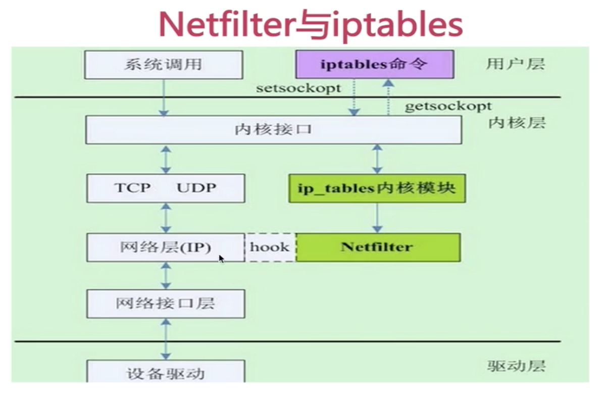

# 2.四表+五链(Hook point)+规则

- 四表：**filter表，nat表**，mangle表，raw表

  filter表：访问控制，规则匹配

  nat表：访问转发

  mangle表和raw表不常用

- 五链：PRE_ROUTING，INPUT，OUTPUT，FORWARD，POST_ROUTING

- 数据包流向：

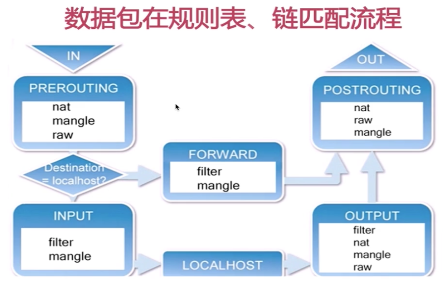


​		本机的包则走PREROUTING，INPUT，LOCALHOST，OUTPUT，POSTROUTING

​		其他机器的包则走PREROUTING，FORWARD，POSTROUTING

​     **<u>可以在PREOUTING链中修改目的地址，则左右了数据包的走向</u>**


# 3.iptables规则组成

- 数据包访问控制：accept  drop(没有消息返回)  reject(有消息返回)

- 数据包改写：SNAT（对发送地址改写），DNAT（对目的地址改写）

- 信息记录：LOG

- 四表五链+规则：

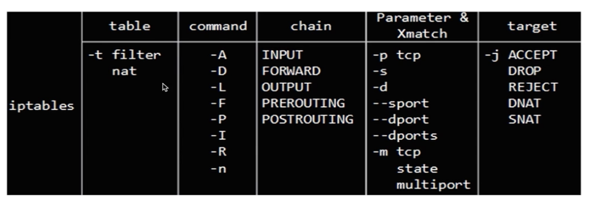

command：

-A：在后面添加规则

-I：插入一条规则到开头

-D：删除规则

-L：显示目前规则

-n：不显示域名什么的，直接显示地址，经常与-L连用，比如iptables -nL

-F：清理现有规则

-P：设置默认规则


# 4.场景

## 场景一

- 规则1:对所有的地址开放本机的tcp(80，22，10-21)端口的访问

   ```shell
  iptables -I INPUT -p tcp —dport 80 -j ACCEPT
  
  iptables -I INPUT -p tcp —dport 22 -j ACCEPT
  
  iptables -I INPUT -p tcp —dport 10:21 -j ACCEPT
  ```

- 规则2:允许对所有的地址开放本机基于ICMP协议的数据包访问

  `iptables -I INPUT -p icmp -j ACCEPT`

- 规则3:其他未被允许的端口则禁止访问

  `iptables -A  INPUT -j REJECT`


检测：端口扫描：`nmap -sS -p 0-1000 10.21.5.100`


**存在的问题**

- 本机无法访问本机

  解决：默认对eth0网卡设备进行设置，因此需要对lo本地网卡设备设置为允许访问

  `iptables -I INPUT -i lo -j ACCEPT`

- 本机无法访问其他主机

  解决：

  ```shell
  iptables -I INPUT -m state —state ESTABLISHED,RELATED -j ACCEPT
  
  curl -I www.imooc.com # 可以获取到数据
  ```

  

如果想要设置只允许10.10.188.233访问本机的httpd服务

```shell
# 删除刚才配置的这条规则
iptables -D INPUT tcp --dport 80 -j ACCEPT
# 专门针对10.10.188.233开放httpd端口
iptables -I INPUT -p tcp -s 10.10.188.233 -dport -80 -j ACCPET
```


## 场景二

- ftp主动模式下iptables的规则配置

  

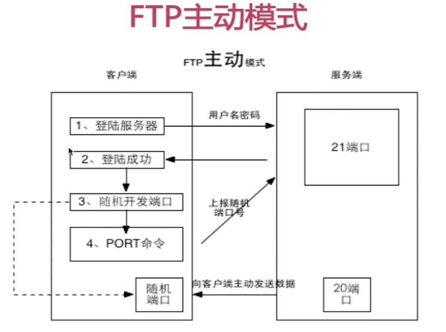


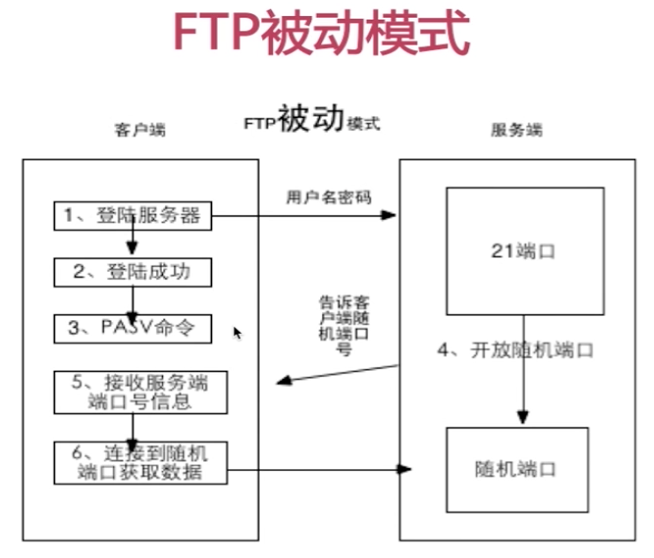


主动模式：服务器端给客户端发送数据，随机端口号在客户端

被动模式：客户端从服务器端拉取数据，随机端口号在服务器端


iptables对于FTP主动模式

```shell
iptables -I INPUT -p tcp -dport 21 -j ACCEPT
```

iptables对于FTP被动模式（默认模式）

```shell
iptables -I INPUT -p tcp --dport 21 -j ACCEPT
# 在配置文件里设置被动模式随机端口的范围
vim /etc/vsftpd/vsftpd.conf
## pasv_min_port=50000
## pasv_max_port=60000

# 打开这个端口范围
iptables -I INPUT -p tcp --dport 50000-60000 -j ACCEPT
```


## 场景三

- 公司里要求：

  1.员工在公司内部(10.10.155.0/24,10.10.188.0/24)能访问服务器上任何服务

  2.当员工在出差时，通过VPN连接到公司

  ​		外网 === 拨号到==>VPN服务器 =====> 内网FTP，SAMBA，NFS，SSH

  3.公司有一个门户网站需要允许公网访问

- 常见端口

  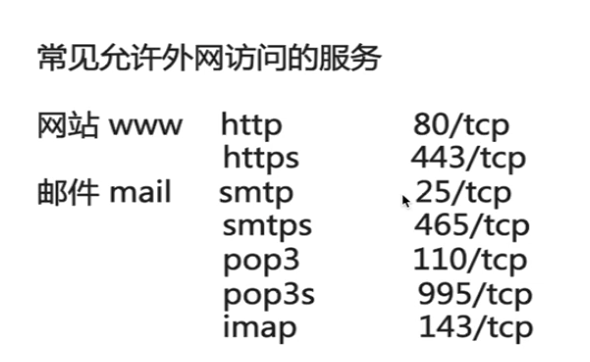

  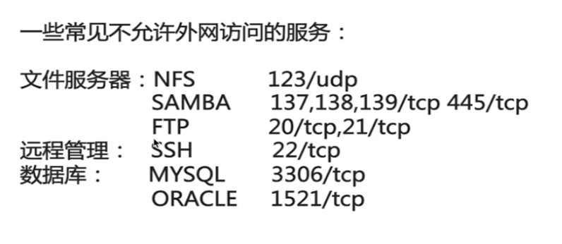

- 配置规则基本思路

  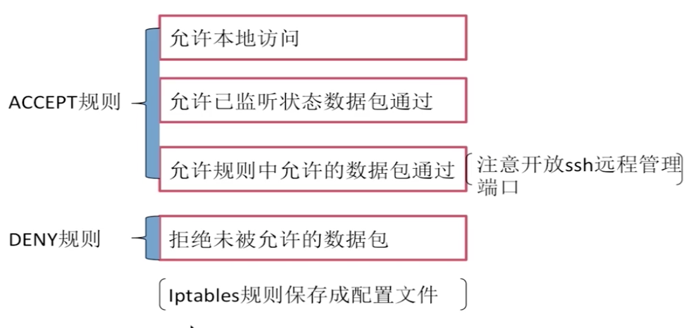

  

  ```shell
  iptables -F
  # 允许本地访问
  iptables -I INPUT -i lo -j ACCEPT
  # 允许已监听状态数据包通过
  iptables -I INPUT -m state --state ESTABLESHED,RELATED -j ACCEPT
  
  # 允许内网的ip通过
  iptables -A INPUT -s 10.10.155.0/24 -j ACCEPT
  iptables -A INPUT -s 10.10.188.0/24 -j ACCEPT
  
  # 允许常用的端口通过
  iptables -A INPUT -p tcp --dport 80 -j ACCEPT
  # vpn常用端口1723
  iptables -A INPUT -p tcp --dport 1723 -j ACCEPT
  iptables  -I INPUT -p icmp -j ACCEPT
  
  # 将其他拒绝
  iptables -A INPUT -j REJECT
  
  # 保存到配置文件
  ## 将命令写到shell文件iptable_ssh.sh文件中
  ## 将/bin/sh /opt/iptable_ssh.sh加入到rc.local文件中
  ```

  

  # 5.nat表规则配置

  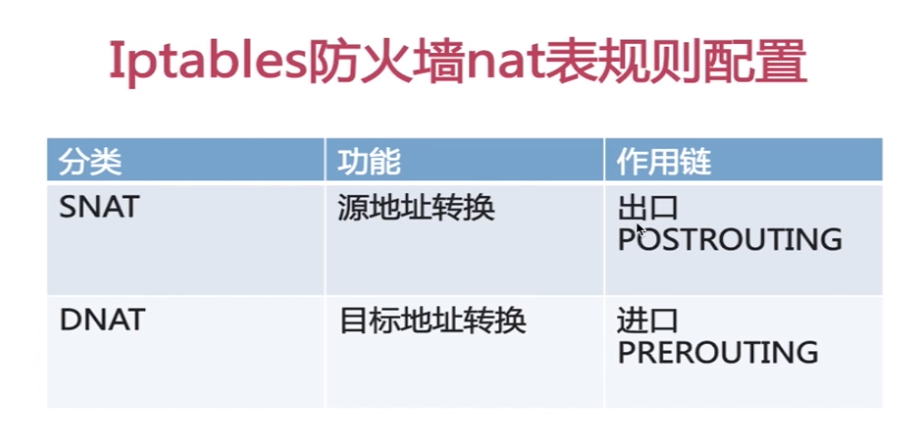

  

  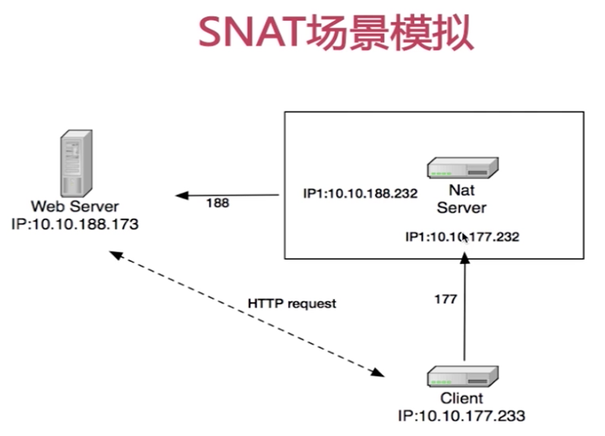
  
  ```shell
  # Web Server 10.10.188.173
  ## 启动一个服务比如nginx
  
  # Nat Server 有双网卡：10.10.188.232 10.10.177.232
  ## 首先在/etc/sysctl.conf文件中打开ip包的转发
  ## net.ipv4.ip_forward=1
  ## 然后重新载入sysctl.conf
  sysctl -p
  ## 加规则
  iptables -t nat -A POSTROUTING -s 10.10.177.0/24 -j SNAT --to 10.10.188.232
  
  # Client 10.10.177.233 
  ## 网关设置为10.10.177.232
  route add 0.0.0.0 gw 10.10.177.232

  ```

  

  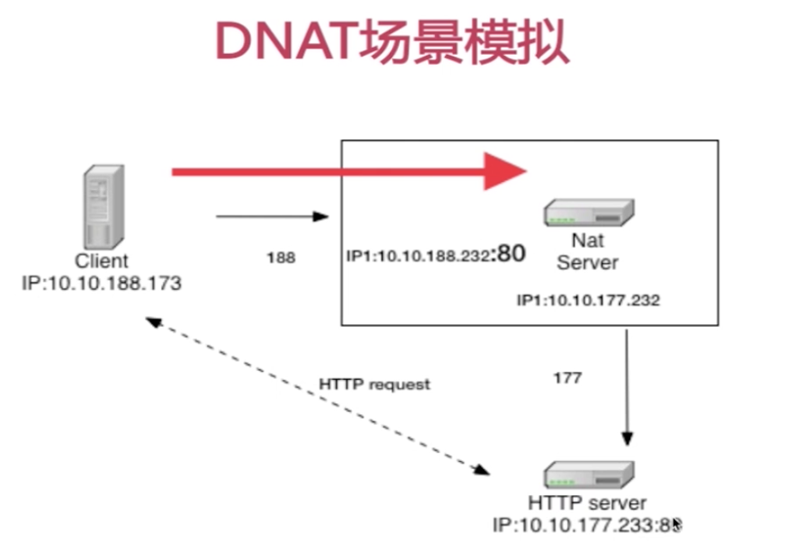
  
  ```shell
  iptables -t nat -F
  
  # Server 233
  ## 开启http服务80端口
  
  
  # Nat Server 两个网卡188.232 177.232
  iptables -t nat -A PREROUTING -d 10.10.188.232 -p tcp --dport 80 -j DNAT --to 10.10.177.233:80
  
  
  # Client 173
  ## 测试
  curl http://10.10.188.232:80
  

  ```
  
  

# 6.iptables防止CC攻击

```shell
# 超过100个就拒绝
iptables -I INPUT -p tcp --syn -dport 80 -m conlimit --connlimit-above 100 -j REJECT

# Limit模块 限流(略) 

```


# 7.iptables完整的规则实例介绍


# 8.总结

- 四表五链+规则

- 多场景介绍iptables规则配置

- 介绍iptables的nat模式

- iptables防CC攻击及实例脚本


