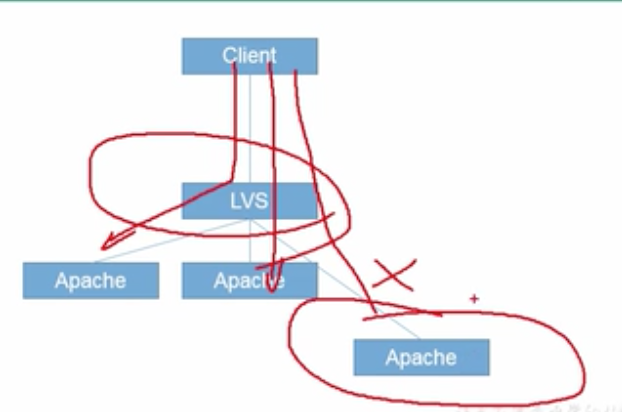

# 集群

b站视频。尚硅谷 linux运维

## 概念

协同工作的服务器，对外表现为一个整体

类型：负载均衡集群LBC，高可用集群HAC，高性能运算集群HPC等

# 负载均衡集群LBC

## LBC介绍

### 负载均衡分类

软件：LVS（四层），Nginx（七层），HaProxy（七层）等

硬件：F5（二层，四层，七层）

### 原理

- 四层（源地址不变，一次tcp连接）

  

- 七层（源地址改变，2次tcp连接）

  

  

访问量：LVS(压力小) >> nginx(压力大)


## LVS讲解

### 工作层级

用户模块：ipvsadm

内核模块：ipvs

### LVS工作模式


- NAT模式

  LVS在中间，有两块网卡，一块公网，一块内网，真实服务器的网关就是LVS服务器，通过DNAT和SNAT进行地址的转变，也**可以进行端口映射**，即真实服务器的访问端口可以与LVS的访问端口不一致，**来回报文均通过LVS服务器，压力较大**

  

  - 工作过程详解（https://www.jianshu.com/p/7dd8546e71c1）

    

- TUN模式

  全连公网，需要LVS服务器进行**二次封包，压力较大**，应用不太广泛，且**不支持端口映射**

  

  - 工作过程详解（https://www.jianshu.com/p/7dd8546e71c1）

    

- DR模式（压力小，并发量大）

  LVS与服务器在同一个广播域，修改二层mac地址（因此必须在同一个广播域），真实服务器的网关是正常的路由器，而非LVS服务器，所以**LVS服务器压力小**，**不支持端口映射**，访问LVS的端口与访问真实服务器的端口一致，无法修改

  

  - 工作过程详解（https://www.jianshu.com/p/7dd8546e71c1）

    

### DR构建


```shell

# LVS和RS关掉NetworkManager服务
service NetworkManager stop
chkconfig NetworkManager off

# 在LVS中网卡eth0添加接口eth0:0，配置ip:10.10.10.100

# 在rs中网卡lo中添加接口lo:0，配置ip:10.10.10.100，可以设置掩码为255.255.255.255

# 配置好后要重启网络

# 在lvs中安装ipvsadm

# 可以在rs中开启httpd服务，写入一个网站，用来进行测试

# 在rs中配置arp设置  //通过配置arp，可以让rs的vip对应网卡闭嘴(不说话也不接收)

# ARP响应级别：
#	arp-ignore
# 	0: 只要本机配置有相应IP地址就响应
#		1: 仅仅在请求的目标地址配置在请求到达的网络接口上才做响应  //只有访问自己ip的时候才响应，访问本机其他网卡不响应

# ARP通告行为
# arp-announce
# 	0: 将本机任何网络接口上的任何地址都向外通告   //将本机网卡所有ip_mac地址开机时均向外广播
# 	1: 尽可能避免像目标网络通告与其网络不匹配的地址信息表
#		2: 仅仅向目标网络通告与其网络相匹配的地址信息  //仅向本网卡所在网段通知自己，而不通知本机其他网卡

## 可以将真实服务器设置为arp-ignore=1，arg-announce=2，则可让lo闭嘴，即不会响应eth0端口收到的报文，也不会向广播域公告自己的地址信息
sysctl -p


## 数据包到达不了lo，那如何回应用户？ 需要配置路由： （目标地址是VIP的包lo处理）
route add -host 10.10.10.100 dev lo:0
# 开机自启
echo "route add -host 10.10.10.100 dev lo:0" >> /etc/rc.local

# 优化：配置lo:0 的掩码配置为32  //自己玩

# 在LVS中配置ipvs规则
# 添加集群
ipvsadm -A -t 虚拟ip:80 -s rr # 指定算法为rr
# 添加真实机器
ipvsadm -a -t 虚拟ip:80 -r 10.10.10.12:80 -g # -g表示为DR模式
ipvsadm -a -t 虚拟ip:80 -r 10.10.10.13:80 -g

# 查看规则
ipvsadm -nL --stats # --stats 可以看到接收和发出的包
# 保存，持久管理
service ipvsadm save

```

### NAT搭建


```shell
# 关闭NetworkManager

# lvs配置
	# lvs开启路由转发
	vi /etc/sysctl.conf
		net.ipv4.ip_forward=1
	sysctl -p

	# lvs的iptables配置，ipvs原生版本制作了DNAT，而并没有做SNAT，所以在这需要自己手动设置SNAT
	iptables -t nat -A POSTROUTING -s 10.10.10.0/24 -o eth0 -j SNAT --to-source 20.20.20.11
	
	# ipvs配置
	ipvsadm -A -t 20.20.20.11:80 -s rr
	ipvsadm -a -t 20.20.20.11:80 -r 10.10.10.12:8080 -m # -m为nat模式 为了验证nat模式下可以进行端口映射，将rs访问端口设置为8080
	ipvsadm -a -t 10.10.10.11:80 -r 10.10.10.13:8080 -m
	ipvsadm -nL
	service ipvsadm save
	chkconfig ipvsadm # 开启
	
	
# 真实服务器配置

	# 添加网关
	echo "GATEWAY=10.10.10.11" >> /etc/sysconfig/network-scripts/ifcfg-eth0
	# 开启httpd，方便测试
	service httpd start
	echo "1111" >> /var/www/html/index.html
	
	# 修改httpd服务端口为8080，用来测试nat模式可以进行端口映射
	vim /etc/httpd/conf/httpd.conf
		listen 8080
	service httpd restart # 重启

```


## LVS调度算法

默认是 wlc

### 静态算法(不考虑服务器压力)

- 根据算法调度
  - RR : 轮询
  - WRR： 加权轮询
  - SH：源地址散列，同一个ip的用户请求会发送给同一个服务器
  - DH： 目标地址散列，同一个目标地址的用户请求发送给同一个真实服务器，可以提高缓存命中率(比如https://www.baidu.com/a/1/jpg，会始终指向同一个rs)   缺点：大家都在搜热点，RS就挂了，可以看下面动态算法LBLC

### 动态算法

活动连接：传输数据

非活动连接：刚建立握手还没传输数据或者传输完数据还没断开

- 除了根据算法调度，也考虑服务器状态
  - LC 最少连接：分配给连接数最少的  活动连接*256+非活动连接（这里256指活动连接性能压力相当于256个非活动连接）
  - WLC 加权最少连接： 权重越大承担的请求越多（活动连接*256+非活动连接）/权重
  - SED 最短期望延迟：特殊的WLC （活动连接+1）*256/权重，避免了连接数为0的情况
  - NQ 永不排队：特殊的SED，无需等待，如果有真实服务器的连接数等于0那就直接分配不需运算
  - LBLC 特殊的DH算法：基本采用DH算法，但当服务器压力较大时，添加其他RS负载。既能提高缓存命中率，又要考虑服务器性能。比如：微博某个热点被挤爆，这种算法可以添加负载均衡
  - LBLCR  LBLC+缓存：尽可能提高负载均衡和缓存命中率的折中方案：缓存之间可以访问    

### LVS持久连接

持久连接优先于通用链接，先匹配持久链接，再进行通用链接

- 持久客户端连接 PCC： 将来自同一个客户端的所有请求统统定向至此前选定的RS，类似于源地址散列

  ```shell
  # -p 120 持久化连接 120s
  ipvsadm -A -t 172.16.0.8:0 -s rr -p 120
  ```

- 持久端口连接 PPC：将来自同一个客户端对某个服务(端口)的请求，始终定向至此前选定的RS

  ```shell
  # -p 120 持久化连接 120s
  ipvsadm -A -t 172.16.0.8:80 -s rr -p 120
  ```

- 持久防火墙标记连接：

  ```shell
  iptables -t mangle -A PREROUTING -d 172.16.0.8 -p tcp --dport 80 -j MARK --set-mark 10
  
  ipvsadm -A -f 10 -s rr -p 120
  ```

# 高可用集群HAC

可用性：几个9

## HAC介绍

原理：心跳检测

LVS问题：某个rs死掉，没法提供服务



## keepalived

### 介绍

​	专为LVS和HA设计的一款健康检查工具

​	支持故障自动切换

​	支持节点健康状态检查	

### 原理

VRRP（virtualrouter redundancy protocol ）虚拟路由冗余协议

一主多备，共用一个虚拟IP地址


## LVS-DR + Keepalived


```shell
# 首先搭建LVS-DR模式集群

# 在LVS-M上安装部署keepalived

# 修改keepalive的配置文件
service keepalived start

# 搭建备份节点

# 配置网卡文件eth0:0 ip地址为集群虚拟地址10.10.10.100

# 执行以下会报错，因为主节点已经在使用10.10.10.100
ifup eth0:0

# 修改ifup的执行文件，将文件中判断重复ip的代码注释掉，再次启动网卡即可

# 然后在备节点中安装部署keepalived，同时设置其配置文件

# 安装ipvsadm 启动后，不需要配置ipvsadm，因为keepalived里面已经写好了集群情况，自动会添加ipvs规则

```

- keepalived不仅可以对LVS设置主备，对真实服务器也有健康检查，即当真实服务器有机器添加或删除，会自动在LVS中添加或删除ipvs规则