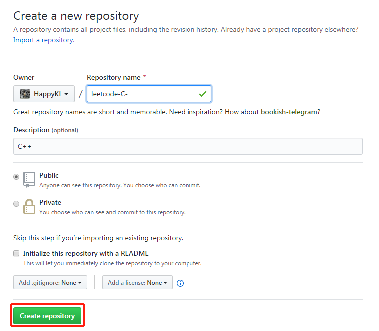

# github操作

## 创建仓库

目标：在github上创建仓库，将本地仓库push到新创建的远程仓库

### 1.new一个仓库



### 2.将本地仓库push到新仓库中

- create a new repository on the command line

  ```shell
  echo "# letecode-C-" >> README.md
  git init
  git add README.md
  git commit -m "first commit"
  git remote add origin git@github.com:HappyKL/letecode-C-.git
  git push -u origin master
  ```

- push an existing repository from the command line

  ```shell
  git remote add origin git@github.com:HappyKL/letecode-C-.git
  git push -u origin master
  ```

  

