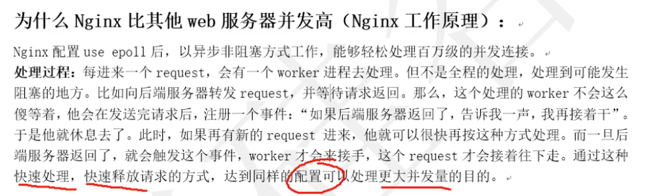
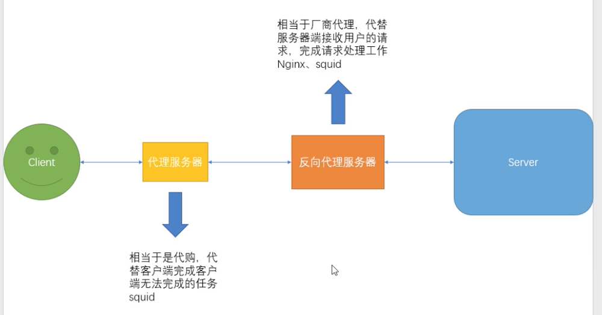

# Nginx

## 同步与异步 && 阻塞与非阻塞

### 同步与异步

重点在于消息通知的方式
- 同步：同步调用发出去后，调用者要一直等待调用的结果通知，才能后续的执行

- 异步：异步调用发出去后，调用者不必一直等待调用结果的通知，通常有两种方案
  - 主动轮询异步调用的结果
  - 被调用方通过callback（回调通知）来通知调用方调用结果

- 实例
  - 同步取快递：收到短信后，去楼下等待快递送达
  - 异步取快递：收到短信后，快递到楼下，才会去取
    - 不停打电话问小哥快递到了没 （主动轮询）
    - 快递小哥到楼下后给打电话通知来取 （回调通知）

### 阻塞与非阻塞

重点在于等消息时候的行为

- 阻塞：调用发出去后，在消息返回前，当前线程/进程会被挂起，知道消息返回，才会被激活

- 非阻塞：调用发出后，不会阻塞进程/线程，而会立即返回
- 实例
  - 阻塞取快递：收到快递短信后，什么事都不做，一直等待快递到达
  - 非阻塞取快递：收到短信后，可以接着敲代码

### 四种方式辨析

- 同步阻塞：收到短信后，啥事不干，去楼下等快递（快递员不再通知）

- 同步非阻塞：收到短信后，去楼下，边刷微博，边等快递 （快递员不再通知）

- 异步阻塞：收到短信后，啥都不干，一直等着快递员打电话通知楼下取快递

- 异步非阻塞：收到短信后，刷着微博，等待快递员打电话通知到楼下取快递

## Nginx工作基本原理

- Apache 同步阻塞    nginx 异步非阻塞

- 大多数程序的IO模型是同步阻塞，每个进程每次只在一个文件描述符上执行I/O操作，每次I/O系统调用都会阻塞，直到完成数据传输
- 传统服务器采用的就是同步阻塞的多进程模型，即一个进程负责一个request，直到会话结束，进程数就是并发数，而操作系统支持的进程是有限的，且进程数越多，调度的开销也越大，因此无法面对高并发

- epoll模型：当连接有IO事件产生时，epoll就会去告诉进程哪个连接有I/O事件产生，然后进程就去处理这个事件。实例：小明楼下有收发室，每次快递到了，门卫会先代收并作标记，然后通知小明去取他的快递

- 

## NGINX实验

### 工作模式

多进程模式/单进程模式

### 状态信息

### 目录保护

### 控制访问

### 虚拟主机

### 反向代理

- 代理服务器：代理用户
- 反向代理服务器：帮助服务器处理请求，隐藏地址，保护服务器安全

### 负载均衡

### 实现https{证书+rewrite}

