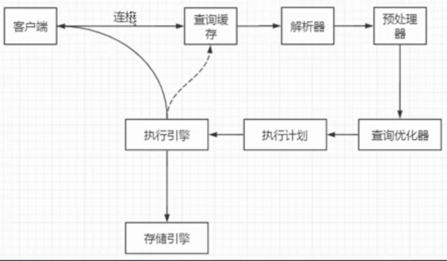
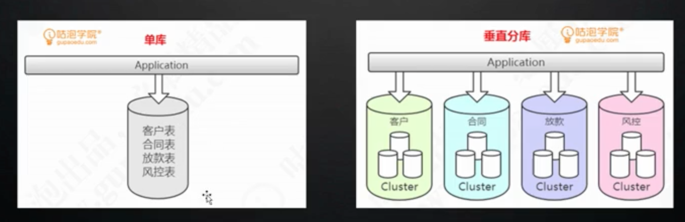
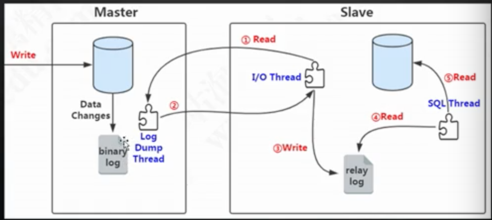

mysql innodb

默认隔离 mvcc+lbcc

快照读(select)

当前读(update/delete/insert)

优化：

- 连接：连接不够用，反复创建连接
  - 可以修改参数，最大连接数
  - 可以使用连接池，复用连接

- 缓存：可以使用外部缓存，比如redis

- 架构

  - 分库分表 mycat

    

  - 主从，读写分离 (binlog实现主从复制)

    

- 索引

- 避免死锁

  

工具：

- 自带

  mysqldumpslow ： 查看慢查询情况

  Profile: 查看执行命令时的各个步骤开销

- 开源工具

